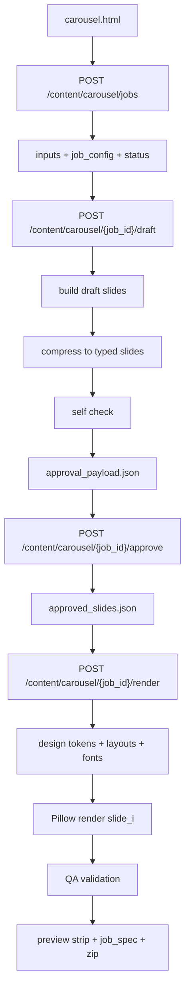

# Instagram Carousel Builder

Документ описывает новый функционал генерации Instagram-каруселей в проекте `FABRIC`: пользовательский сценарий, технический pipeline, backend endpoints, файловую структуру job и текущие ограничения MVP.

## Что делает функционал

Новый flow строит карусель для Instagram feed с целевым канвасом `1080x1350` (`4:5`):

- пользователь задает тему или вставляет свой текст
- загружает `ref_style_images[]` и, при необходимости, `subject_image` и `brand_assets`
- система создает `job`
- генерирует или адаптирует тексты под карусель
- показывает обязательный экран `approve/edit`
- после подтверждения рендерит итоговые слайды через Pillow
- прогоняет QA
- отдает итоговый пакет:
  - `slides/01.png ... NN.png` или `jpg`
  - `job_spec.json`
  - `preview_strip.png`
  - `carousel_<job_id>.zip`

Главный принцип качества: текст не рисуется нейросетью внутри картинки. Текст всегда отрисовывается программно поверх фона и декоративных слоев, поэтому результат остается читаемым и предсказуемым.

## Точка входа

UI:

- `GET /ui/carousel`

Основной шаблон:

- `app/templates/carousel.html`

API:

- `POST /content/carousel/jobs`
- `POST /content/carousel/{job_id}/draft`
- `POST /content/carousel/{job_id}/approve`
- `POST /content/carousel/{job_id}/render`
- `GET /content/carousel/{job_id}`
- `GET /content/carousel/{job_id}/download/{file_path}`

## Пользовательский путь

### 1. Ввод параметров

На странице `/ui/carousel` пользователь заполняет:

- `topic`
- `lang`
- `slide_count`
- `user_text` при наличии готового текста
- `ref_style_images[]`
- `subject_image`
- `brand_assets[]`
- набор `style_vars`

Затем UI отправляет multipart-запрос на `POST /content/carousel/jobs`.

### 2. Создание job

Backend:

- создает `job_id`
- сохраняет входные файлы в `data/carousels/<job_id>/inputs/`
- нормализует вход в `CarouselJobConfig`
- сохраняет `job_config.json`
- создает `status.json`

После этого UI запускает генерацию draft через `POST /content/carousel/{job_id}/draft`.

### 3. Генерация текста

Если `user_text` пустой:

- используется `CarouselTextService.generate_draft_slides()`
- вызывается LLM с JSON-схемой `draft_slides[]`
- при ошибке используется fallback-генерация на backend

Если `user_text` передан:

- текст разбивается на смысловые куски
- backend собирает `DraftSlide` без вызова генератора тем

Далее для всех случаев:

- `compress_to_typed_slides()` преобразует draft в `TypedSlide`
- `self_check_typed_slides()` прогоняет самопроверку
- `build_approval_payload()` собирает данные для UI-редактирования

Результаты сохраняются в:

- `draft_slides.json`
- `typed_slides.json`
- `typed_slides_checked.json`
- `approval_payload.json`

### 4. Approval текста

Это обязательный шаг.

UI получает `approval_payload` и показывает по каждому слайду:

- `title`
- `bullets[]`
- `emphasis_words[]`
- `cta`

Пользователь вручную правит текст и нажимает `Approve Edited Text`.

UI отправляет:

- `POST /content/carousel/{job_id}/approve`

Backend:

- принимает финальные тексты
- повторно нормализует их в `TypedSlide`
- снова прогоняет текст через self-check
- сохраняет итог в `approved_slides.json`
- переводит job в статус `approved`

До этого шага рендер не запускается.

### 5. Рендер карусели

После approval UI вызывает:

- `POST /content/carousel/{job_id}/render`

Backend на этой стадии:

- извлекает style bundle
- выбирает layout template для каждого слайда
- готовит `subject_image`, если он есть
- рендерит слайды через Pillow
- прогоняет QA
- при необходимости делает один повторный проход с уменьшенными размерами шрифта
- собирает итоговые артефакты

### 6. Получение результата

UI получает:

- список готовых слайдов с download/open URL
- `preview_strip_url`
- `job_spec_url`
- `zip_url`

Превью выводятся сразу на странице, а все файлы можно открыть через `/content/carousel/{job_id}/download/...`.

## Технический pipeline



## Порядок обработки на backend

### Шаг 1. Нормализация входа

Файл:

- `app/services/carousel_text_service.py`

Метод:

- `build_job_config(...)`

Что делает:

- нормализует язык
- определяет наличие `user_text`
- определяет наличие `subject_image`
- фиксирует `slide_count`
- переносит `style_vars` в итоговый конфиг
- формирует `safe_margins`

### Шаг 2. Draft generation

Методы:

- `build_source_draft_slides(...)`
- `generate_draft_slides(...)`

Что делает:

- либо вызывает LLM для `draft_slides[]`
- либо строит черновик из `user_text`
- в fallback-режиме создает осмысленную структуру без LLM

### Шаг 3. Compaction в typed slides

Метод:

- `compress_to_typed_slides(...)`

Что делает:

- переводит слайды в формат `TypedSlide`
- разбивает текст на `title_block` и `bullet_blocks`
- ограничивает размер текстов
- готовит блоки под конкретный canvas

### Шаг 4. Самопроверка текста

Метод:

- `self_check_typed_slides(...)`

Что делает:

- проверяет длины заголовков и буллетов
- ограничивает количество пунктов
- устраняет дубли заголовков
- оставляет `remaining_risks`, если текст спорный

### Шаг 5. Approval payload

Метод:

- `build_approval_payload(...)`

Что делает:

- превращает `TypedSlide` в UI-friendly формат
- задает лимиты редактирования через `EditRules`
- подготавливает payload для ручной правки

## Как извлекается стиль

Файл:

- `app/services/carousel_style_service.py`

Что делает MVP:

- анализирует `ref_style_images[]`
- извлекает базовую палитру через простую квантование цветов
- собирает `design_tokens`
- выбирает набор `layout_templates`
- строит `font_plan`

Текущее поведение:

- для background используется отдельный image-generation вызов через OpenAI Images API
- для каждого слайда может генерироваться отдельная иллюстрация
- если image generation недоступен или завершается ошибкой, pipeline откатывается на deterministic fallback

## Как выбираются шрифты

Файл:

- `app/services/font_registry.py`

Что делает:

- ищет доступные локальные шрифты
- предпочитает `Noto Sans` и `DejaVu Sans`
- формирует `FontPlan`
- проверяет поддержку кириллицы и латиницы по известным fallback-путям

## Как подготавливается `subject_image`

Файл:

- `app/services/carousel_asset_service.py`

Текущее поведение:

- исходное изображение пропускается через `rembg`
- строится alpha-mask cutout
- изображение обрезается по непустому bbox
- уменьшается под hero-зону
- к нему применяется скругление
- добавляется мягкая тень
- сохраняется как `subject_prepared.png`

Если neural cutout не сработал:

- pipeline откатывается на fallback
- используется исходное изображение без удаления фона

## Как получаем итоговые слайды

Файл:

- `app/services/carousel_render_service.py`

### Что происходит по каждому слайду

1. Создается canvas `1080x1350`
2. Если сгенерирован background:
   - он подставляется как базовый слой
3. Поверх него дорисовываются контролируемые эффекты:
   - вертикальный градиент
   - неоновые линии
   - vignette
   - grain
4. Если для слайда есть generated illustration:
   - она размещается в `illustration_boxes`
5. При наличии subject:
   - subject размещается в `hero_box`
6. Рисуются фоновые карточки под title и bullets
7. Для текста подбирается размер шрифта:
   - `_fit_single_block()` для title/cta
   - `_fit_bullets()` для bullets
8. Текст программно рисуется через Pillow:
   - stroke
   - shadow
   - glow
   - переносы строк
9. Слайд сохраняется как `png` или `jpg`
10. Возвращается `layer_map`

### Почему текст остается читаемым

Потому что:

- текст не baked-in в фон
- шрифт известен и контролируем
- размер подбирается под bbox
- есть stroke и shadow
- рендер идет поверх заранее подготовленных чистых зон

## Как апрувим правильность слайда

Есть два уровня проверки.

### 1. Текстовый approve от пользователя

Это ручная проверка до рендера:

- пользователь видит все слайды до генерации финальных картинок
- может переписать заголовки и буллеты
- backend считает именно эту версию финальной

Это главный бизнес-уровень контроля качества.

### 2. Автоматический QA после рендера

Файл:

- `app/services/carousel_qa_service.py`

Что проверяется сейчас:

- выход текста за `safe_margins`
- пересечение текстовых блоков друг с другом
- отсутствие буллетов у контентного слайда

Результат сохраняется в `qa_report.json`.

Если QA не проходит:

- `carousel_job_service.render()` делает повторный рендер
- уменьшает `font_h1_size`, `font_body_size`, `font_caption_size`
- запускает рендер и QA повторно

Если повторный вариант лучше:

- он становится итоговым
- в `fixes_applied[]` добавляется `Reduced font sizes for safe fit`

## Как собирается экспорт

Файл:

- `app/services/carousel_export_service.py`

Что делает:

- собирает `preview_strip.png` из миниатюр слайдов
- сохраняет `job_spec.json`
- собирает zip с результатами

`job_spec.json` включает:

- `job_id`
- итоговый `config`
- `approved_slides`
- `design_tokens`
- `layout_templates`
- `font_plan`
- `outputs`
- `qa_report`

## Файловая структура job

Все артефакты находятся в:

- `data/carousels/<job_id>/`

Структура:

```text
data/carousels/<job_id>/
├── inputs/
│   ├── input_request.json
│   ├── assets.json
│   ├── ref_style_01.png
│   ├── subject.png
│   └── brand_01.*
├── intermediate/
│   ├── job_config.json
│   ├── draft_slides.json
│   ├── typed_slides.json
│   ├── typed_slides_checked.json
│   ├── approval_payload.json
│   ├── approved_slides.json
│   ├── design_tokens.json
│   ├── layout_templates.json
│   ├── font_plan.json
│   ├── asset_manifest.json
│   └── qa_report.json
├── assets/
│   └── subject_prepared.png
├── slides/
│   ├── 01.png
│   ├── 02.png
│   └── ...
├── exports/
│   ├── preview_strip.png
│   ├── job_spec.json
│   ├── outputs.json
│   └── carousel_<job_id>.zip
└── status.json
```

`asset_manifest.json` хранит:

- `background_path`
- `subject_cutout_path`
- `illustrations_by_slide`

## Статусы job

Файл:

- `status.json`

Текущие статусы:

- `created`
- `draft_ready`
- `approved`
- `rendering`
- `completed`
- `failed`

Дополнительно хранится:

- `current_step`
- `error`
- `created_at`
- `updated_at`

## Что уже реализовано в MVP

- job-based flow
- загрузка референсов и ассетов
- генерация текста
- approval/edit экрана
- Pillow render
- layout presets
- font fallback
- QA по размещению текста
- preview strip
- `job_spec.json`
- zip export

## Что пока упрощено

- style extraction пока базовый, без Vision-LLM анализа layout conflicts
- neural cutout делается через `rembg`, а не через кастомную обученную модель проекта
- background и illustrations генерируются отдельно, но пока без дополнительной post-selection логики
- QA пока не считает реальный contrast score по пикселям
- async queue пока нет, рендер синхронный

## Рекомендуемый сценарий проверки

1. Откройте `GET /ui/carousel`
2. Загрузите 1-3 `ref_style_images`
3. Укажите `topic`
4. Нажмите `Create Job + Generate Draft`
5. Проверьте и поправьте тексты
6. Нажмите `Approve Edited Text`
7. Нажмите `Render Carousel`
8. Проверьте:
   - все ли слайды открываются
   - не вылезает ли текст
   - корректен ли `job_spec.json`
   - собирается ли ZIP
